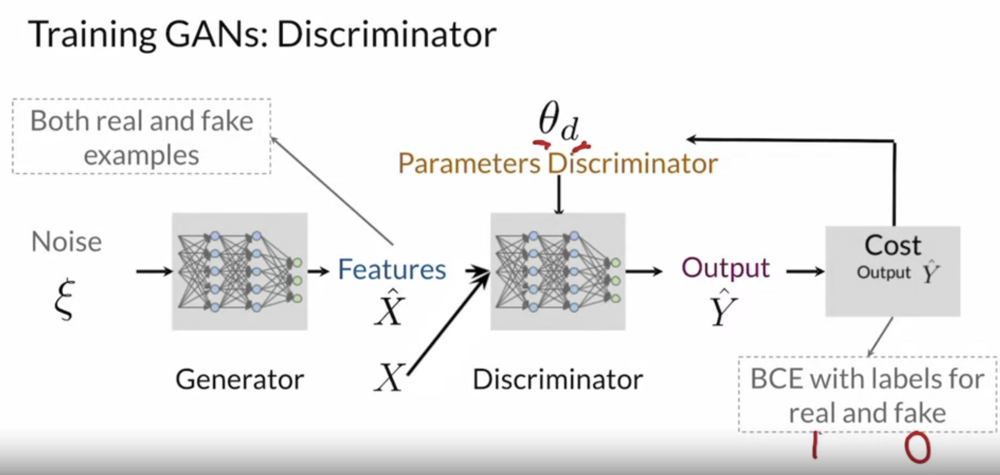
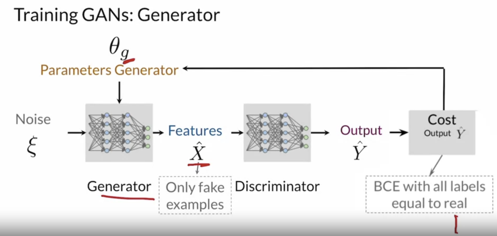

# Generative Models

* Discriminative models distinguish classes (labels) of input samples (features). They learn
  $P(Y/X)$
* Generative models learn to produce realistic samples/features (conditioned by classes or not). They learn
  $P(X/Y)$ or $P(X)$

## real life GANs

# Discriminator

- The discriminator is a classifier
- It learns to classify Real or Fake for a given features X
- The probabilities are feedbacks for the generator

# Generator

- The generator produces fake data (features)
- It learns the probability of features X
- The generator takes noise (random features) as input

# Binary Cross Entropy (BCE) Cost Function

$$
J(\theta) = - \frac{1}{m} \sum_{i=1}^m [y^{(i)} \log \hat{y}^{(i)} + (1 - y^{(i)}) \log (1 - \hat{y}^{(i)})]
$$
with $y, \hat{y}$ are respectively the ground truth and the predicted values. Given the $\theta$-parameterized predicted $h(x, \theta)$:
$$
J(\theta) = - \frac{1}{m} \sum_{i=1}^m [y^{(i)} \log h(x^{(i)}, \theta) + (1 - y^{(i)}) \log (1 - h(x^{(i)}, \theta))]
$$

# Training GAN

##  train the discriminator

## train the generator

## Problem

- Discriminator takes an easier job, learns more quickly
- If the discriminator is perfect, $\hat{y}$ is almost *fake*, then the generator cannot improve -> Collapse of training
- Both two models should always be at a similar "skill" level