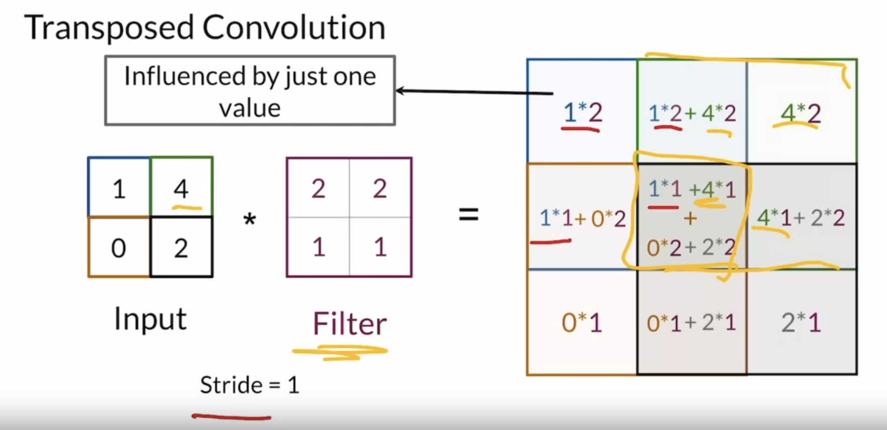

# Activation functions

- Non-linear: to break the linearity, otherwise the whole NN is just a linear function
- differentiable: to permit backpropagation

## Common function
- ReLU
  $g(z) = max(0, z)$ -> $\frac{dg}{dz} = \{1\ if\ z > 0\ else\ 0\}$
- Leaky ReLU
  $g(z) = max(a \times z, z)\ with\ a >\approx 0$ -> $\frac{dg}{dz} = \{1\ if\ z > 0\ else\ a\}$
- Sigmoid
  $g(z) = \frac{1}{1 + e^{-z}}$
- Tanh
  $g(z) = \frac{e^z - e^{-z}}{e^z + e^{-z}}$
- 

# Batch Normalization

# Transpose Convolution

- learnable matrix for upsampling
- problem: checkerboard patterns

# Image generation

