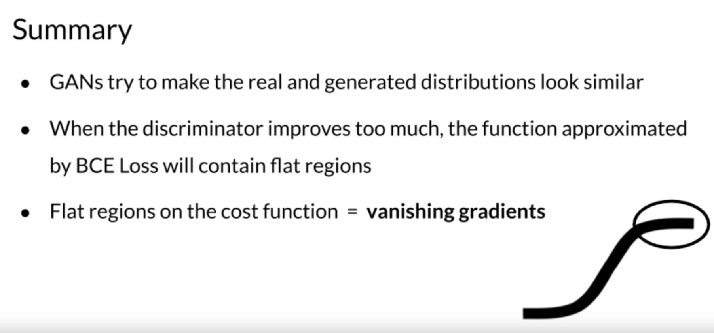

# Mode Collapse

- Mode is any peak on the probability distribution.
- In real world, datasets' features have many modes
- Mode collapse happens when the generator gets stuck in one mode.

## Problem with BCE Loss

# Wasserstein Loss

## BCE Loss simplified

$$
J_{\theta} = - \frac{1}{m} \sum_{i=1}^m [y^{(i)} \log \hat{y}^{(i)} + (1 - y^{(i)}) \log (1- \hat{y}^{(i)})]
$$

- Generator: maximize cost
- Discrimiator: minimize cost

## W-Loss

Approximates Earth Mover's distance

$$
\min_g \max_c E(c(x)) - E(c(g(z)))
$$

- Critic $c$ function is not bounded to $[0,1]$ as the discriminator
- Critic needs to be 1-L continuous: the norm of the gradient should be at most 1 for every point

## 1-L Continuity enforcement

- Weight clipping
- Gradient penalty

