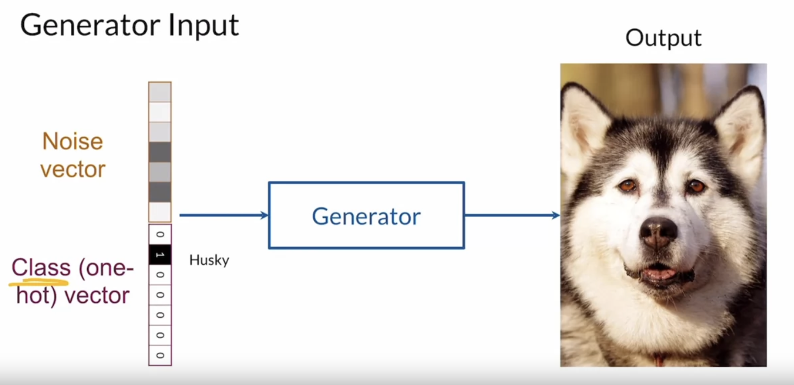

# Conditional GAN

## Generator inputs

- Noise vector
- Class vector - used to be one-hot coding

## Discriminator inputs

- Generated (faked) outputs
- Class vector

# Controllable Generation

## Interpolation
- finding feature vectors int he Z-space: for example the hair color
- use the feature vector to control, adding to the noise vector, to change the desired feature, for example the hair color.

## Challenges

### feature correlation

## Classifier gradients

- Make a pretrained classifier on the desired feature, for example having glasses
- Use the pipeline noise Z -> generator -> discriminator to produce loss then use the technique of "Adversarial Example Generation" to modify the Z based on its gradient from loss backprogation.

## Disentanglement